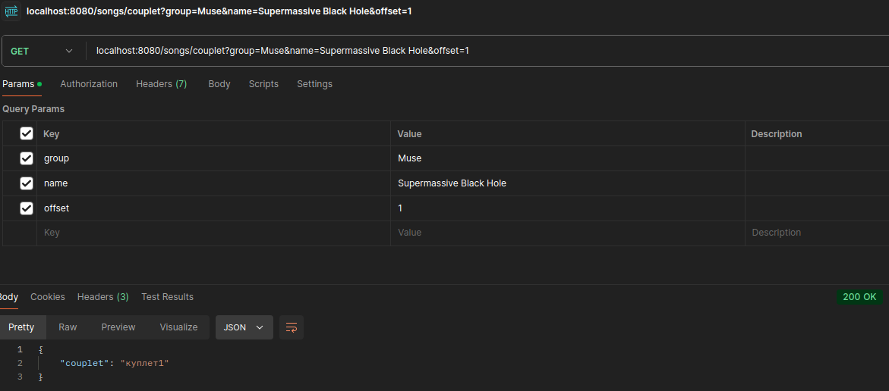

# music_library
Онлайн библиотека песен

## Запуск

Можно запустить приложение в контейнере:

1. склонировать репозиторий
2. перейти в папку с репозиторием
3. export POSTGRES_USER=[значение] POSTGRES_PASSWORD=[значение] POSTGRES_DB=[значение] POSTGRES_HOST=postgres
4. docker compose up -d

Можно локально:

1. склонировать репозиторий
2. перейти в папку с репозиторием
3. запуск postgres: docker-compose up -d postgres
4. make run


## Схема бд

В бд хранится одна таблица с песнями
``` sql
    create table if not exists songs (
    song_group text,
    name text,
    release_date date,
    text text,
    link text,
    primary key (song_group, name)
    );
```

## Примеры работы

### Создание песни


### Удаление


### Получение информации о библиотеке


### Обновление песни


### Получение информации о песне


### Получение куплета




